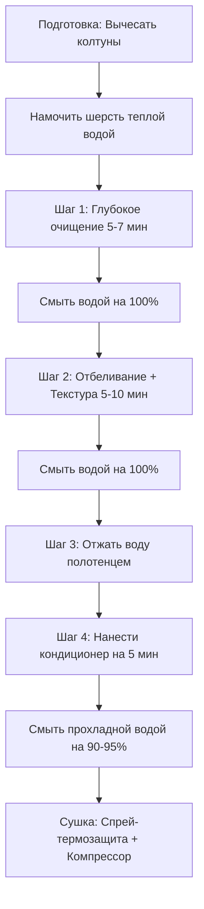

# Полное руководство по косметике для самоедов: типы, правила, схемы мытья и запреты

Шерсть самоеда уникальна — она состоит из плотного, мягкого подшерстка и вертикально стоящей жесткой остевой шерсти, которая отталкивает грязь и защищает собаку от жары и холода. Неправильно подобранная косметика может «убить» этот естественный барьер, сделав шерсть ватной, тусклой и склонной к мгновенному образованию колтунов.

Ниже приведено подробное руководство по правильному выбору и пошаговому применению косметики для самоеда.

---

## 🧼 1. Основные виды косметики для самоеда

Вся грумерская косметика делится на пять функциональных групп. Для качественного мытья самоеда вам понадобятся средства из каждой группы:

1.  **Супер-очищающие шампуни (Deep Cleaning / Clarifying Shampoos):**
    *   *Зачем:* Смывают застарелую грязь, кожный жир, пыль и остатки старой косметики. Это подготовительный этап. Без него последующие лечебные или отбеливающие шампуни просто не проникнут в структуру волоса.
    *   *Примеры:* *Iv San Bernard Ginger & Elderberry*, *Bio-Groom Groom 'n Clean*.
2.  **Отбеливающие / Цветокорректирующие шампуни (Whitening / Brightening Shampoos):**
    *   *Зачем:* Устраняют желтоватый оттенок шерсти, следы от слюны и грязи. Качественные отбеливающие шампуни не содержат химических осветлителей (перекиси), а работают за счет синих/фиолетовых оптических пигментов, которые визуально нейтрализуют желтизну, делая шерсть жемчужно-белой.
    *   *Примеры:* *Iv San Bernard Cristal Clean*, *Bio-Groom Super White*, *Chris Christensen White on White*.
3.  **Текстурирующие шампуни (Texturizing Shampoos):**
    *   *Зачем:* Придают шерсти упругость, жесткость и объем. Самоед не должен выглядеть гладким или мягким как пудель. Его ость должна стоять «щитом». Текстураторы приподнимают шерсть от корней.
    *   *Примеры:* *Crown Royale Biovite OB Shampoo №3*, *Chris Christensen Spectrum One*.
4.  **Кондиционеры, бальзамы и маски (Conditioners & Masks):**
    *   *Зачем:* Шампуни открывают чешуйки волоса, чтобы очистить его. Кондиционер **обязан** закрыть эти чешуйки. Он питает волос изнутри, запечатывает влагу, предотвращает ломкость, отталкивает грязь и облегчает вычесывание. Без кондиционера шерсть самоеда превратится в сухую солому, которая моментально пожелтеет и спутается в колтуны.
    *   *Примеры:* *Iv San Bernard Cristal Clean Balm*, *Crown Royale Conditioner*.
5.  **Защитные и распутывающие спреи (Sprays & Detanglers):**
    *   *Зачем:* Облегчают скольжение расчески, снимают статическое электричество, защищают шерсть от термического ожога при сушке компрессором и от выгорания на солнце (УФ-фильтры).
    *   *Примеры:* *Chris Christensen Ice on Ice*, *Show Tech Fast Dri*.

---

## 🚿 2. Пошаговая схема мытья самоеда (Очередность нанесения)

Никогда не наносите шампунь прямо из бутылки на сухую собаку. Мытье самоеда — это строгий многоэтапный ритуал.

### ➡️ Подробное описание шагов:

*   **Шаг 0: Подготовка.** Полностью прочешите собаку гребнем до мытья. Убедитесь, что на теле нет колтунов. Тщательно и долго (около 10 минут) смачивайте самоеда теплой водой. Шерсть самоеда водонепроницаема, поэтому нужно руками раздвигать шерсть, чтобы вода дошла до кожи.
*   **Шаг 1: Первое мытье (Очищение).** Разведите супер-очищающий шампунь с теплой водой в пропорции (обычно 1:5 или 1:10) в специальной бутылочке. Нанесите пену на собаку, хорошо помассируйте кожу и шерсть в течение 5 минут. **Полностью смойте водой.**
*   **Шаг 2: Второе мытье (Цвет и Текстура).** 
    *   *Вариант А (Повседневный):* Нанесите разведенный отбеливающий шампунь на желтые участки шерсти (лапы, борода, штаны) и разведенный текстурирующий шампунь на корпус. Оставьте на 5-10 минут.
    *   *Вариант Б (Выставочный коктейль):* Смешайте в одной бутылке разведенный отбеливающий шампунь и текстурирующий в пропорции 1:1. Это даст одновременно и ослепительный цвет, и объем. Оставьте на 5-7 минут. **Смойте водой до скрипа.**
*   **Шаг 3: Кондиционирование.** Слегка отожмите шерсть руками или полотенцем. Если наносить кондиционер на текущую воду, он просто стечет с волоса. Разведите кондиционер теплой водой (1:5) и обильно нанесите на всю шерсть, особенно прорабатывая штаны, воротник и лапы. Оставьте на 5 минут.
*   **Шаг 4: Ополаскивание.** Смойте кондиционер прохладной водой.
    *   *Важно:* Не смывайте кондиционер на 100% «до скрипа». Шерсть должна оставаться слегка скользкой на ощупь. Это создает невидимую защитную пленку на волосках.
*   **Шаг 5: Сушка.** Заверните собаку в полотенце на 10 минут для впитывания влаги. Равномерно распылите спрей-термозащиту (*Chris Christensen Ice on Ice*) по шерсти и приступайте к сушке компрессором, одновременно прочесывая шерсть пуходеркой.

---

## 🚫 3. Категорические ЗАПРЕТЫ (Что делать нельзя)

> [!CAUTION]
> **1. НЕ МЫТЬ СОБАКУ С КОЛТУНАМИ**
> Если помыть самоеда с нерасчесанными колтунами, под воздействием теплой воды и шампуня они затянутся в плотный войлок («сваляются как валенок»). После высыхания разобрать их будет невозможно — только полностью выстригать.

> [!CAUTION]
> **2. НЕ НАНОСИТЬ НЕРАЗВЕДЕННЫЕ КОНЦЕНТРАТЫ**
> Профессиональная косметика (ISB, Crown Royale, Chris Christensen) имеет очень высокую концентрацию. Нанесение неразбавленного средства непосредственно на кожу может вызвать химический ожог, сильнейшую аллергию, зуд и перхоть. Всегда используйте бутылку для смешивания с мерной шкалой.

> [!CAUTION]
> **3. НЕ ОСТАВЛЯТЬ СОБАКУ СОХНУТЬ ЕСТЕСТВЕННЫМ ПУТЕМ**
> Мокрый подшерсток самоеда сохнет сам более 24 часов. Внутри этой влажной теплой «шубы» мгновенно создается парниковый эффект. Это идеальная среда для размножения бактерий и грибков, что гарантированно приведет к появлению **мокнущей экземы (hot spots)**, от которой шерсть вылезает клочьями, а кожа покрывается гнойными ранами. Сушка компрессором на 100% обязательна!

> [!CAUTION]
> **4. НЕ ИСПОЛЬЗОВАТЬ ШАМПУНИ ДЛЯ ЛЮДЕЙ**
> Кислотность (pH) кожи человека составляет около 5.5 (кислая среда), а кожи собаки — около 7.5 (ближе к щелочной). Человеческий шампунь быстро смоет защитный липидный слой кожи самоеда, вызвав дерматиты и сильную перхоть.

---

## ✅ 4. Полезные СОВЕТЫ и ЛАЙФХАКИ (Что делать нужно)

> [!IMPORTANT]
> **1. Контроль температуры воды**
> Мыть самоеда нужно теплой водой (около 35–37°C). Слишком горячая вода сушит кожу и делает остевой волос ломким. Ополаскивать от кондиционера желательно прохладной водой — это стимулирует закрытие чешуек волоса и делает шерсть более блестящей.

> [!TIP]
> **2. Лайфхак для белизны лап**
> Если лапы самоеда сильно пожелтели от глины или реагентов, нанесите неразведенный отбеливающий шампунь *ISB Cristal Clean* пальцами точечно на сухие (!) лапы за 10 минут до ванны. Шампунь впитается в сухой волос и вытянет пигмент грязи гораздо эффективнее. Затем мойте собаку по обычной схеме.

> [!TIP]
> **3. Защита ушей и глаз**
> При мытье головы самоеда всегда закрывайте ушные раковины ватными дисками, чтобы вода не затекла в ушной канал (это может вызвать отит). Смывайте пену с морды, направляя струю воды строго от глаз назад к шее.
