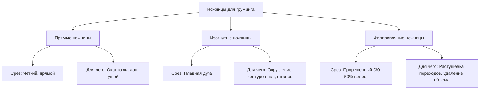

# Руководство по грумерским ножницам: виды, отличия и правила применения для самоеда

Стрижка самоеда носит исключительно гигиенический и косметический характер (окантовка лап, оформление ушей, гигиена паха). **Категорически запрещено брить самоеда машинкой налысо**, так как это разрушает терморегуляцию двойного покрова и ведет к алопеции (облысению) и солнечным ожогам. 

Для правильного ухода владельцу или грумеру необходим базовый набор ножниц. Ниже подробно описано, чем отличаются разные виды ножниц, когда их применять, и приведены наглядные примеры стрижки.

---

## ✂️ 1. Основные виды ножниц и их отличия

Грумерские ножницы делятся на три основных типа. Они различаются формой лезвий, типом среза и назначением.



---

### 📏 1.1. Прямые ножницы (Straight Shears)
*Классический инструмент с ровными лезвиями.*

*   **Как работают:** Делают четкий, ровный срез. Длина варьируется от 4.5 до 10 дюймов.
    *   *Короткие ножницы (4.5 - 6 дюймов):* Используются для точечной, ювелирной работы (стрижка вокруг глаз, пальцев лап).
    *   *Длинные ножницы (7 - 8.5 дюймов):* Используются для выравнивания больших плоскостей шерсти самоеда.
*   **Когда применять для самоеда:**
    *   **Пример:** Стрижка шерсти на лапе вровень с когтями для создания ровной окантовки подошвы.
    *   **Пример:** Выстригание шерсти, торчащей из ушной раковины, по прямой линии.

---

### 弧 1.2. Изогнутые ножницы (Curved Shears)
*Ножницы, лезвия которых изогнуты под определенным углом.*

*   **Как работают:** Позволяют стричь по кругу или дуге без необходимости постоянно поворачивать руку под неестественными углами. Срез получается округлым и мягким.
*   **Когда применять для самоеда:**
    *   **Пример: Стрижка «Кошачья лапка» (Cat Paw).** Самоед славится аккуратными собранными лапами. С помощью изогнутых ножниц шерсть вокруг лапы состригается полукругом сверху вниз, формируя аккуратный пушистый «шарик».
    *   **Пример: Стрижка «Штанов» (Pants) и воротника.** Помогает оформить плавную округлую линию очесов на задних лапах и придать форму жабо на груди.

---

### ░ 1.3. Филировочные ножницы (Thinning & Chunking Shears)
*Ножницы, у которых одно или оба лезвия имеют зубцы (похожи на расческу).*

*   **Как работают:** Состригают только часть волос, попавших под лезвие (от 30% до 60%). Это позволяет проредить шерсть, убрать лишний объем или сделать границу среза абсолютно незаметной и естественной.
*   **Разновидности:**
    *   **Классические филиры (Thinners):** Имеют много мелких зубцов. Делают срез очень мягким, «размытым». Идеальны для растушевки переходов.
    *   **Шанкеры / Чанкеры (Chunkers):** Имеют редкие и широкие Т-образные зубья. Срезают больше шерсти за раз (до 50-70%), оставляя текстурированный, максимально естественный «рваный» край.
*   **Когда применять для самоеда:**
    *   **Пример: Зона за ушами.** У самоедов за ушами растет очень мягкий пух, склонный к образованию колтунов. Филировочными ножницами прореживают эту зону, убирая лишний подшерсток, но сохраняя естественный вид.
    *   **Пример: Сглаживание переходов.** После стрижки лап прямыми или изогнутыми ножницами часто видны «ступеньки» (следы от лезвий). Филировочными ножницами прорабатывают эти переходы, чтобы лапа выглядела так, будто она выросла такой округлой формы сама.

---

## 📐 2. Наглядные схемы и техники применения для самоеда

### 🐾 Схема 1: Стрижка лапы «Кошачья лапка» (Cat Paw)

Правильно подстриженная лапа самоеда выглядит собранной, круглой и не собирает грязь и устюки с земли.

```
Этап 1: Выстригание снизу (Триммер / Короткие прямые ножницы)
  [   Подушечки лап   ] -> Выстричь всю шерсть ВРОВЕНЬ с подушечками лап снизу.
                       Шерсть не должна торчать наружу под подушечки.

Этап 2: Расчесывание вверх (Гребень)
  [ Шерсть между пальцев ] -> Зачесать пуходеркой или гребнем всю шерсть НАВЕРХ.

Этап 3: Создание окружности (Изогнутые ножницы)
  [ Окантовка по кругу ] -> Поставить изогнутые ножницы концами вниз и обрезать
                           торчащую вверх шерсть по кругу лапы в форме полусферы.

Этап 4: Финишная растушевка (Филировочные ножницы)
  [ Сглаживание переходов ] -> Пройтись филирами по верхнему краю среза, чтобы
                              убрать резкую границу между лапой и пальцами.
```

---

### 👂 Схема 2: Оформление ушей самоеда

Уши самоеда должны выглядеть аккуратными, треугольными и пушистыми.

1.  **Расчесывание:** Тщательно вычесать шерсть на ушах и за ними гребнем.
2.  **Зажим уха:** Аккуратно зажмите кончик уха пальцами левой руки (это защитит кожу от случайного пореза).
3.  **Срез прямыми ножницами:** Срежьте торчащую за контуры ушного хряща шерсть прямыми короткими ножницами, двигаясь снизу вверх вдоль края уха.
4.  **Филировка:** Проредите шерсть у основания уха с помощью филировочных ножниц, чтобы убрать лишний объем подшерстка, где чаще всего образуются колтуны от ошейника.

---

## 🚫 3. Ошибки и правила безопасности

> [!IMPORTANT]
> **ПРАВИЛО БЕЗОПАСНОСТИ №1: Контроль пальцев**
> Стригите шерсть между пальцами или на ушах самоеда, только предварительно нащупав и закрыв пальцами край кожи. Кожа самоеда очень эластичная и легко попадает под лезвия ножниц, особенно в складках лап.

> [!CAUTION]
> **ОШИБКА: Использование бытовых или канцелярских ножниц**
> Канцелярские ножницы не режут густую собачью шерсть, а «заминают» и рвут ее. Это причиняет боль собаке. Профессиональные грумерские ножницы имеют лазерную заточку (часто конвексную), которая позволяет срезать волос одним мягким движением.

> [!TIP]
> **УХОД ЗА НОЖНИЦАМИ:**
> После каждой стрижки протирайте лезвия сухой салфеткой из микрофибры для удаления остатков шерсти и влаги. Раз в неделю наносите каплю специального масла на винтовой сустав ножниц, чтобы сохранить плавность хода.
